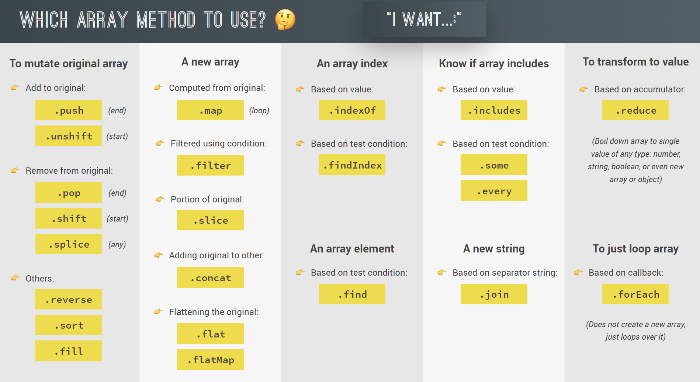

# WORKING WITH ARRAYS

<br><br>

## Content:

1. [Simple array methods](#1-simple-array-methods)
2. [The new at Method](#2-the-new-at-method)
3. [Looping Arrays, forEach](#3-looping-arrays-foreach)
4. [forEach with Maps and Sets](#4-foreach-with-maps-and-sets)
5. [Creating DOM elements](#5-creating-dom-elements)
6. [map, filter, reduce](#6-map-filter-reduce)
7. [The map method](#7-the-map-method)
8. [Computing usernames](#8-computing-usernames)
9. [The filter method](#9-the-filter-method)
10. [The reduce method](#10-the-reduce-method)
11. [Chaining methods](#11-chaining-methods)
12. [The find method](#12-the-find-method)
13. [Implementing Login](#13-implementing-login)
14. [Implementing Transfers](#14-implementing-transfers)
15. [The findIndex method](#15-the-findindex-method)
16. [some and every](#16-some-and-every)
17. [flat and flatMap](#17-flat-and-flatmap)
18. [Sorting arrays](#18-sorting-arrays)
19. [More ways of creating and filling arrays](#9-more-ways-of-creating-and-filling-arrays)
20. [SUMMARY](#20-summary)
21. [More exercises](#21-more-exercises)
22. [Resources](#22-resources)

[Resources](#20-resources)

<br><br>

---

## 1. Simple array methods

<br>

What we know from before:

- `push()`

- `unshift()`

- `pop()`

- `shift()`

- `indexOf`

- `includes`

<br><br>

New ones:

- `slice()`

- `splice()`

- `reverse()`

- `concat()`

- `join()`

### Why arrays have methods

<br>

Methods are functions we can call on objects. They are attached to objects.

If there are array methods, it means **arrays are also objects. They get access to built-in methods.**

<br><br>

`slice()`

<br>

Copies a portion of an array to a new array.

You can extract part of the original array, without changing it.

Accessor method.
<br><br>

**parameters**

1: start with the index number of the first element we want

2: end with the index number following the last element we want (this parameter is not included in the output)
<br>

```js
let array = ['a', 'b', 'c', 'd', 'e'];

console.log(array.slice(2)); // (3) ['c', 'd', 'e']
console.log(array.slice(2, 4)); // (2) ['c', 'd']
```

<br><br>

Length of a new array will be `parameter2 - parameter1` .
<br><br>

**Negative parameter copies from the end.**

This took last two parameters.
<br>

```js
console.log(array.slice(-2)); // (2) ['d', 'e']
```

<br>

Last element of any array: `array.slice(-1);`
<br><br>

Negative last parameter extracts everything **except that**.
<br>

    console.log(array.slice(1, -2)); // (2) ['b', 'c']

<br><br>

**Create shallow copy**

A matter of preference if you use `slice()` or spread operator.

`Slice()` is necessary if you want to **chain methods**.
<br>

```js
console.log(array.slice()); // (5) ['a', 'b', 'c', 'd', 'e']

console.log([...array]); // (5) ['a', 'b', 'c', 'd', 'e']
```

<br><br>

`splice()`
<br>

**Mutator method** = mutates original array.

Can add or remove an item from any position in an array or add and remove simultaneously.

**For deleting one or more elements from the array.**
<br><br>

**parameters**

1: the index number to start at

2: the number of items to remove

3: items to add (optional).
<br>

```js
let array = ['a', 'b', 'c', 'd', 'e'];

console.log(array.splice(2)); // (3) ['c', 'd', 'e'] = what we extracted (gone)

console.log(array); // (2) ['a', 'b'] = what is left from the original array
```

<br><br>

**syntax**

<br>

    splice(start)
    splice(start, deleteCount)
    splice(start, deleteCount, item1)
    splice(start, deleteCount, item1, item2, itemN)

<br><br>

**common use case**

Remove last element.
<br>

```js
console.log(array.splice(-1)); // ['e'] = removed element
console.log(array); // (4) ['a', 'b', 'c', 'd'] = what is left from the original array

// starting from position 1, take out 2 elements

console.log(array.splice(1, 2)); // (2) ['b', 'c'] = deleted
```

<br><br>

`reverse()`
<br>

**Mutator method.**

Reverses the order of the elements in an array: last element will be first, and the first element will be last.
<br><br>

```js
const arr = ['j', 'i', 'h', 'g', 'f'];
console.log(arr.reverse());
// (5) ['f', 'g', 'h', 'i', 'j']
```

<br><br>

`concat()`
<br>

Accessor method.

Merges two or more arrays to a new array. Can take multiple arguments, effectively allowing you to concatenate many arrays.
<br><br>

**parameters**
<br>

1: array on which the method is called

2: array we pass into the method
<br><br>

```js
const array = let array = ['a', 'b', 'c', 'd', 'e'];
const arr = ['f', 'g', 'h', 'i', 'j'];

const letters = array.concat(arr);

console.log(letters); // (7) ['a', 'd', 'f', 'g', 'h', 'i', 'j']
```

<br><br>
Another way of doing this.
Gives the same result, no mutation of arrays.
<br>

    console.log([...array, ...arr]); // (7) ['a', 'd', 'f', 'g', 'h', 'i', 'j']

<br><br>

`join()`
<br>

Accessor method.

Converts all the elements of an array into a new string.
<br>

If no argument is given, the output of `join()` will be a comma-separated string with no extra whitespace.

In order to include whitespace or another separator, you can add a string of your separator as a parameter to the `join()` method. This parameter will contain the separator you would like between each array element.
<br><br>

```js
join(', ');
join(' - ');

console.log(letters.join('-')); // a-d-f-g-h-i-j
```

<br><br>

---

**Resources**

<br>

- [Accessor methods](https://www.digitalocean.com/community/tutorials/how-to-use-array-methods-in-javascript-accessor-methods)

- [Mutator methods](https://www.digitalocean.com/community/tutorials/how-to-use-array-methods-in-javascript-mutator-methods)

- [Iteration methods](https://www.digitalocean.com/community/tutorials/how-to-use-array-methods-in-javascript-iteration-methods)

<br><br>

---

## 2. at method

<br>

`at()`

<br>

The `at()` method takes an integer value and returns the item at that index, allowing for positive and negative integers. Negative integers count back from the last item in the array.
<br>

- ES2022 method

- can replace bracket notation
  <br><br>

```js
const atArr = [12, 34, 56];

// traditional way to take value out
console.log(arr[0]); // 12

// ES2022
console.log(arr.at(0)); // 12
```

<br><br>

**Why is it useful instead of bracket notation**
<br>

**To get the last element of the array**. We don't know the length of the array.
There are different ways.
<br><br>

**a:**

    console.log(atArr[atArr.length - 1]); // 56

<br>

**b:**

    console.log(atArr.slice(-1)); // [56], you get copy of array
    console.log(atArr.slice(-1)[0]); // 56, [] gets the value out

<br>

**c:**

    console.log(atArr.at(-1)); // 56
    console.log(atArr.at(-2)); // 34

<br><br>

**When to use** `at()`

<br>

- getting the last element of the array

- counting from the end of an array

- method chaining
  <br><br>

**When too use bracket notation**
<br>

- quickly getting value out of array
  <br><br>

`at()` **also works on strings.**
<br>

```js
console.log('mari'.at(2)); // r
console.log('jonas'.at(5)); // undefined
console.log('jonas'.at(3)); // a

// get last character of string
console.log('jonas'.at(-1)); // s
```

<br><br>

---

## 3. Looping Arrays, forEach

<br>

Executes a provided function once for each array element.
<br>

Loop over the array using `forEach` .

It is different from `for..of` loop.

**Which one you use, depends on your coding style.**
<br><br>

- [for..of loop](https://developer.mozilla.org/en-US/docs/Web/JavaScript/Reference/Statements/for...of)
  <br>

- [forEach() method](https://developer.mozilla.org/en-US/docs/Web/JavaScript/Reference/Global_Objects/Array/forEach)
  <br><br>

_Loop over the array and print for each movement in the bank account, wether the user deposited or withdrew the money._

- _positive values = deposits_
- _negative values = withdrawals_

<br><br>

`for..of` loop
<br><br>

```js
for (const movement of movements) {
  if (movement > 0) {
    console.log(`You deposited ${movement}.`);
  } else if (movement < 0) {
    // Math.abs tahes absolute value, removes minus
    console.log(`You withdrew ${Math.abs(movement)}.`);
  }
}
```

<br><br>

`forEach()`
<br><br>

- higher order function

- requires callback
  <br><br>

- `forEach` calls the callback function in each iteration of looping over the array

- in each iteration, it passes the current element of the array as an argument
  <br><br>

```js
// forEach()
movements.forEach(function (movement) {
  if (movement > 0) {
    console.log(`You deposited ${movement}.`);
  } else if (movement < 0) {
    console.log(`You withdrew ${Math.abs(movement)}.`);
  }
});
```

<br><br>

**In each iteration, the current element is passed in the callback function.**
<br>

    // iteration 0: function(200)
    // iteration 1: function(450)
    // iteration 2: function(400)
    // iteration 3: function(3000)

<br><br>

Callback is used to tell the higher-order function `forEach()` what to do.

**The callback function contains instructions.**

<br><br>

### When you need access to counter variable

<br>

- **in `for..of` loop**
  <br>

`.entries()` is a method which returns array of arrays `[ [currentIndex], [value] ]` .
<br><br>

```js
for (const [i, movement] of movements.entries()) {
  if (movement > 0) {
    console.log(`Movement ${i + 1}: You deposited ${movement}.`);
  } else if (movement < 0) {
    console.log(`Movement ${i + 1}: You withdrew ${Math.abs(movement)}.`);
  }
}

In Console:

Movement 1: You deposited 200.
Movement 2: You deposited 450.
Movement 3: You withdrew 400.
```

<br><br>

- **with `forEach()`**
  <br><br>

`forEach()` passes in:

1. current element

2. the `i` (index)

3. the entire array we are looping

<br><br>

We can **specify them in parameter list.**

Just one, two or all can be used.

<br><br>

Names don't matter, **the order matters and it has to be the one above**. That is the order the arguments are passed into the callback. It is reversed from the order in `for..of` loop, which receives `i`, `mov`.
<br><br>

```js
movements.forEach(function (mov, i, array) {
  if (mov > 0) {
    console.log(`Movement ${i + 1}: You deposited ${mov}.`);
  } else if (mov < 0) {
    console.log(`Movement ${i + 1}: You withdrew ${Math.abs(mov)}.`);
  }
});
```

<br><br>

### When to use which

<br>

You can't break out of `forEach()` method. `continue` nor `break` statements don't work in the `forEach` loop.

**It will always loop over the entire array.**
<br><br>

If you need to break out of the loop, use `for..of` loop.

## <br><br>

## 4. forEach with Maps and Sets

<br>

### Maps

<br><br>

```js
const currencies = new Map([

  // [key, value]
  ['USD', 'United States dollar'],
  ['EUR', 'Euro'],
  ['GBP', 'Pound sterling'],
]);

currencies.forEach(function (value, key, map) {
  console.log(`#{key}: ${value}`);
});

// In the Console:

USD: United States dollar
EUR: Euro
GBP: Pound sterling
```

<br><br>

`forEach()` will call the function with **3 arguments**:

1. current value in the current iteration

2. key

3. entire map

<br><br>

### Sets

<br><br>

```js
const currenciesUnique = new Set(['USD', 'GBP', 'USD', 'EUR', 'EUR']);

console.log(currenciesUnique); // Set(3) {'USD', 'GBP', 'EUR'}

currenciesUnique.forEach(function (value, key, set) {
  console.log(`${key}: ${value}`);
});

// In the Console

USD: USD;
GBP: GBP;
EUR: EUR;
```

<br><br>

**Key is the same as the value.**

Set doesn't have keys nor indexes.

`key` parameter is redundant, it is the same as the first for Sets, but it is kept for the sake of not causing confusion.
Basically, it is this `function(value, value, set)`.

But, since there can't be duplicate arguments, this is valid:
<br>

    forEach(function(value, _ , set){})

<br><br>

---

## 5. Creating DOM elements

<br><br>

opacity: 0 >> element is invisible

opacity: 100 >> element is visible
<br>

Log in/out changes the opacity (JS).

<br><br>

###Displaying movements
<br>

- each movements has one element

- with `forEach()` we loop through movements array, each iteration displays one element for each movement
  <br><br>

- good practice is to create a function and pass the data in instead of have the function work with a global variable
  <br><br>

- create **HTML template with template literal**

- add movements data
  <br><br>

- attach created HTML template to the `movements` container with `insertAdjacentHTML()` method

- new movements are added on top with `afterbegin` >> inverted with `beforeend`
  <br><br>

### Adding new elements

<br>

- first, empty the container: `containerMovements.innerHTML = "";`

<br><br>

```js
const account1 = {
  owner: 'Jonas Schmedtmann',
  movements: [200, 450, -400, 3000, -650, -130, 70, 1300],
  interestRate: 1.2, // %
  pin: 1111,
};

// display of movements
const displayMovements = function (movements) {
  // empty the container to add new elements
  containerMovements.innerHTML = '';

  movements.array.forEach(function(mov, i) => {

    // check if deposit or withdrawal
    const depositType = mov > 0 ? 'deposit' : 'withdrawal';

    // creating one row of movements
    const html = `
      <div class="movements__row">
        <div
          class="movements__type movements__type--${depositType}">
          ${i + 1} ${depositType}
        </div>
        <div class="movements__value">${mov}</div>
      </div>`;

    // attach HTML template to movements element
    containerMovements.insertAdjacentHTML('afterbegin', html);
  });
};

```

<br><br>

`insertAdjacentHTML(1, 2)`
<br><br>

Accepts 2 strings:
<br>

1: position at which we want to attach the HTML

2: text, string containing HTML we want to insert
<br>

    containerMovements.insertAdjacentHTML('afterbegin', html);

<br>

[MDN insertAdjacentHTML](https://developer.mozilla.org/en-US/docs/Web/API/Element/insertAdjacentHTML)

<br><br>

`textContent` VS `innerHTML`
<br>

- `textContent` returns only the text

- `innerHTML` returns everything, including the HTML (included all HTML tags)
  <br>

      console.log(containerMovements.innerHTML); // displays complete HTML

<br><br>

---

## 6. map, filter, reduce

<br>

**Data transformation**
<br>

**Tools for creating new arrays based on transforming data from other arrays.**
<br><br>


<br><br>

`map() `
<br>

- similar to `forEach()`, but better because it creates a new array

- maps value of original array to a new array
  <br><br>

Creates a new array populated with the results of calling a provided function on every element in the calling array:
<br>

1. takes an array

2. loops over it

3. in each iteration, applies a callback function that we specify, to the current array element
   <br><br>

[map() MDN](https://developer.mozilla.org/en-US/docs/Web/JavaScript/Reference/Global_Objects/Array/map)

<br><br>

`filter()`
<br>

- filters for elements from original array that satisfy a condition
  <br>

Creates a new array with all elements that pass the test implemented by the provided function.
<br>

[filter() MDN](https://developer.mozilla.org/en-US/docs/Web/JavaScript/Reference/Global_Objects/Array/filter)

<br><br>

`reduce()`
<br>

- boils down/reduces all the elements of the original array into a single value

- has a snowball effect

- no new array, just the reduced value
  <br>

[reduce](https://www.digitalocean.com/community/tutorials/how-to-use-array-methods-in-javascript-iteration-methods#reduce)

<br><br>

---

## 7. The map method

<br>

The `map()` method creates a new array populated with the results of calling a provided function on every element in the calling array.
<br><br>

```js
const array1 = [1, 4, 9, 16];

// pass a function to map
const map1 = array1.map(x => x * 2);

console.log(map1);
// expected output: Array [2, 8, 18, 32]
```

<br><br>

**Syntax**

    // Arrow function
    map((element) => { /* ... */ })
    map((element, index) => { /* ... */ })
    map((element, index, array) => { /* ... */ })

    // Callback function
    map(callbackFn)
    map(callbackFn, thisArg)

<br><br>

**Parameters**

`callbackFn`
Function that is called for every element of arr. Each time callbackFn executes, the returned value is added to newArray.

The function is called with the following arguments:
<br><br>

`element`
The current element being processed in the array.
<br>

`index`
The index of the current element being processed in the array.
<br>

`array`
The array map was called upon.

<br><br>

**Use case of `map()`**
<br>

- looping over arrays

- makes new array

- at each position of the new array, there are results of applying callback to the original array elements

- doesn't mutate original array

<br><br>

```js
const movements = [200, 450, -400, 3000, -650, -130, 70, 1300];

// conversion rate
const eurToUsd = 1.1;

// store it to variable because map() returns new array
//  const movementsUSD = movements.map(function (mov) {
//  return mov * eurToUsd;
// });

// arrow function variant
const movementsUSD = movements.map(mov => mov * eurToUsd);

console.log(movements);
console.log(movementsUSD);
```

<br><br>

With `map()`, we **use function to create a new array**.

In line with functional programming.

It is prefered (modern).

<br><br>

same example with `forOf()` loop
<br>

```js
const movementsUsd = [];

for (const mov of movements) {
  movementsUsd.push(mov * eurToUsd);
}

console.log(movementsUsd);
```

<br><br>

With `forOf()`, we loop over one array and manually create a new one.

<br><br>
`map()` has access to 3 parameters:
<br>

1. current element

2. current index

3. whole array
   <br>

We won't log the result to the console, but **return the string so that it gets put into a new array**, which is a result of `map()`.

There can be more than 1 return statements in a function, as long as just one is executed.
<br><br>

```js
const movDescr = movements.map(
  (mov, i) =>
    `Movement ${i + 1}: You ${mov > 0 ? 'deposited' : 'withdrew'} ${Math.abs(
      mov
    )}`
);

console.log(movDescr);
```

<br><br>

**Difference between** `return` **and** `console.log`
<br><br>

`console.log` will display the parameter passed to the log method in the console window. Use this method to display a string or variable in the console window.

It is a function (you can see the brackets) that will write the argument value on the console. And only the debuging console, in a browser you will not see anything on the screen.
<br><br>

When using the `return` statement, the function will stop executing, and return the specified value.

The main purpose of the `return` value, is to use the function return value like you would have use a variable value.

<br><br>

---

## 8. Computing usernames

Computing usernames

<br>

`map()` and `forEach()` for computing user names for each account owner in the app
<br><br>

**We will create a side-efect.**
When we modify something, in JavaScript, we cause side effects. This simply means modifying or changing our code, causing it to have unpredictable behaviour and mutability.

We will be producing a side-effect/are doing something to the account object. We won't return a new value.
<br><br>

**username** = initials of each of the users
<br>

`" "` = space

`""` = empty string
<br><br>

**Steps:**
<br>

1. transform the string to lowercase: `toLowerCase()`

2. to take only 1st letters of each word, split string into multiple words with `split(" ")`, dividing by spaces

3. loop over the array with `map()`, take only first letter and join the strings with `join("")` with empty string
   <br><br>

```js
const user = 'Steven Thomas Williams'; // stw

const username = user
  .toLowerCase()
  .split(' ')
  .map(word => word[0])
  .join('');
console.log(username); // stw
```

<br><br>

We'll make a function out of it:
<br>

```js
const createUsernames = function (user) {
  const username = user
    .toLowerCase()
    .split(' ')
    .map(word => word[0])
    .join('');

  console.log(username);
};
createUsernames('Jonas Schmedtmann'); //js
```

<br><br>

_Compute 1 username for each of account holders in the accounts array._
<br>

    const accounts = [account1, account2, account3, account4];

<br><br>

We do not want to create a new array (no `map()`), we want to modify the existing elements in accounts array >> `forEach()`
<br>

- receive all the accounts (array of accounts)

- create a new property on all objects: `username`
  <br><br>

```js
const createUsernames = function (accs) {
  // side-effects: mutating original array
  accs.forEach(function (acc) {
    acc.username = acc.owner // new property on objects
      .toLowerCase()
      .split(' ')
      .map(word => word[0])
      .join('');
  });
};

createUsernames(accounts);
```

<br><br>

**We don't return anything, we are producing a side-effect/are doing something to the `account` object.**

We don't use arrow function because we are not creating a value to be returned.

<br><br>

---

## 9. The filter method

<br>

Filters for elements that satisfy certain condition.

The `filter()` method creates a new array with all elements that pass the test implemented by the provided function.
<br><br>

```js
const words = [
  'spray',
  'limit',
  'elite',
  'exuberant',
  'destruction',
  'present',
];
const result = words.filter(word => word.length > 6);

console.log(result);
// expected output: Array ["exuberant", "destruction", "present"]
```

<br><br>

**Syntax**
<br><br>

    // Arrow function
    filter((element) => { /* ... */ } )
    filter((element, index) => { /* ... */ } )
    filter((element, index, array) => { /* ... */ } )

    // Callback function
    filter(callbackFn)
    filter(callbackFn, thisArg)

<br><br>

[MDN filter()](https://developer.mozilla.org/en-US/docs/Web/JavaScript/Reference/Global_Objects/Array/filter)

<br><br>

### Specifying a condition

<br>

- use callback function

- callback has access to current element, index & entire array (mov, i, array)

- usually, in `filter()` we only need the current element

- **return a boolean value**
  <br><br>

Create an array of only deposits ( > 0 ).
<br>

```js
const movements = [200, 450, -400, 3000, -650, -130, 70, 1300];

const deposits = movements.filter(function (mov) {
  return mov > 0 ? true : false;
});

console.log(deposits);
// (5) [200, 450, 3000, 70, 1300]
```

<br><br>

variant with `for..of` loop:
<br>

```js
const deposit2 = [];

for (const mov of movements) {
  if (mov > 1) {
    deposit2.push(mov);
  }
}

console.log(deposit2);
// (5) [200, 450, 3000, 70, 1300]
```

<br><br>

### What to use?

<br>

`filter()` is more functional and practical. We can **chain methods together**.

String methods can be used with array methods. Also, big chains of array methods can be made.

It is impossible with `for..of` loop.

<br><br>

---

## 10. The reduce method

<br>

The reduce`()` method executes a user-supplied "reducer" callback function on each element of the array,

in order,

passing in the return value from the calculation on the preceding element.

The final result of running the reducer across all elements of the array is a single value.

The first time that the callback is run there is no "return value of the previous calculation".
If supplied, an initial value may be used in its place.

Otherwise the array element at index 0 is used as the initial value and iteration starts from the next element (index 1 instead of index 0).

Perhaps the easiest-to-understand case for `reduce()` is to return the sum of all the elements in an array:
<br><br>

```js
const array1 = [1, 2, 3, 4];

// 0 + 1 + 2 + 3 + 4
const initialValue = 0;
const sumWithInitial = array1.reduce(
  (previousValue, currentValue) => previousValue + currentValue,
  initialValue
);

console.log(sumWithInitial);
// expected output: 10
```

<br><br>

The reducer walks through the array element-by-element, at each step adding the current array value to the result from the previous step (this result is the running sum of all the previous steps) — until there are no more elements to add.
<br><br>

**Syntax**
<br>

```js
// Arrow function
reduce((previousValue, currentValue) => {
  /* ... */
});
reduce((previousValue, currentValue, currentIndex) => {
  /* ... */
});
reduce((previousValue, currentValue, currentIndex, array) => {
  /* ... */
});
reduce((previousValue, currentValue, currentIndex, array) => {
  /* ... */
}, initialValue);

// Callback function
reduce(callbackFn);
reduce(callbackFn, initialValue);
```

<br><br>

[MDN reduce()](https://developer.mozilla.org/en-US/docs/Web/JavaScript/Reference/Global_Objects/Array/Reduce)

<br><br>

**Boiling down all the elements in an array to one single value.**
<br>

Adding up all the numbers in one array.
<br><br>

`reduce()` has two parameters:
<br>

1. **callback function**

The callback function is called in each iteration of looping over the array.
<br><br>

Parameters of the callback:
<br>

1. **accumulator = current sum of all previous values**

2. current element

3. index

4. whole array

<br><br>

```js
const balance = movements.reduce(
  // first parameter
  function (accumulator, element, i, arr) {
    return accumulator + element;
  }

  //, (second parameter)
);
```

<br><br>

2. **initial value of the accumulator**
   <br><br>

- the one in the 1st loop iteration

- we specify it
  <br><br>

```js
const balance = movements.reduce(function (accumulator, element, i, arr) {
  return accumulator + element;
}, 0);

console.log(balance); // 3840
```

<br><br>

**Get the max value from the array**
<br>

The value we boil down the array to, can be anything, it doesn't have to be a sum.
It can be a maximum value, multiplication; string, object...

<br><br>

Process/**pseudo code**:
<br>

1.  Store the first value as the current maximum (make the acc the current value).
    <br>

        ... ), movements[0];

<br><br>

2. Check if the next value is greater than the previous one. If so, store it as a current maximum.
   <br><br>

```js
  if (acc > mov) {
    return acc;
  } else (acc < mov) {
    return mov;
  }
```

<br><br>

3. Keep going through the array until the end.

<br><br>

When you use `reduce()`, ask this: **what should be the purpose of he accumulator?**
<br><br>

- keep track of the current sum (1st example)

- keep track of the current max value (2nd example)
  <br><br>

```js
const maxValue = movements.reduce((acc, mov) => {
  if (acc > mov) {
    return acc;
  } else {
    return mov;
  }
}, movements[0]);
```

<br><br>

### Making a new object with reduce() (advanced)

<br><br>

- we can also make a new array

- `reduce()` can replace many methods
  <br><br>

Create an object which contains sum of `deposits` and of the `withdrawals`. Calculate 2 sums at the same times, in one go.
<br><br>

```js
const sums = accounts
  .flatMap(account => account.movements)
  .reduce(
    (sums, cur) => {
      cur > 0 ? (sums.deposits += cur) : (sums.withdrawals += cur);

      return sums;
    },
    { deposits: 0, withdrawals: 0 }
  );

console.log(sums); // {deposits: 25180, withdrawals: -7340}
```

<br><br>

2nd parameter, the starting point, needs to be an object since we are creating an object.

It can be an empty object `{}`.

Or we can start filling it `{ deposits: 0, withdrawals: 0 }`. This object is also sums in the callback function, the **accumulator, its initial value**.
<br><br>

`sums` is accumulator, which holds `deposits` and `withdrawals`.

<br><br>

1. change: **destructure the object at the declaration phase**
   <br><br>

instead of this: `const sums = accounts ...`
<br>

write this: `const [ deposits, withdrawals ] = accounts ...`
<br><br>

2. change: **use bracket notation with conditional selecting**
   <br><br>

instead of this: `cur > 0 ? (sums.deposits += cur) : (sums.withdrawals += cur);`
<br>

write this: `sums[cur > 0 ? 'deposits' : 'withdrawals'] += cur;`

<br><br>

---

## 11. Chaining methods

<br>

_Take all movements deposits._

_Convert € > $._

_Add everything so you know how much was deposited in $._
<br><br>

Each operation can be done individually, with each result in a new variable, but it can also be done in one go by chaining.
<br><br>

```js
const totalDepositsUSD = movements
  .filter(mov => (mov > 0 ? true : false))
  .map(mov => mov * eurToUsd)
  .reduce((acc, mov) => acc + mov, 0);

console.log(totalDepositsUSD); // 5522.000000000001
```

<br><br>

You can chain as many methods as you want, as long as they return new arrays.

**You can only chain a method after a one that returns an array.**
<br><br>

**Hard to debug if one of the results is not as expected.
For that, check the array at each step with** `console.log()`.
<br><br>

Use case of the `arr` as a parameter. It is a result of the previous operation in the chain.
<br><br>

```js
.filter(mov => (mov > 0 ? true : false))
.map((mov, i, arr) => {
  // console.log(arr);
  mov * eurToUsd;
})
```

<br><br>

1. Don't overuse chaining, optimize it. It can cause performance issue if it is huge.

2. **Bad practice to chain methods that mutate the original array.**

<br><br>

---

## 12. The find method

<br>

The `find()` method returns the first element in the provided array that satisfies the provided testing function. If no values satisfy the testing function, `undefined` is returned.
<br><br>

```js
const array1 = [5, 12, 8, 130, 44];

const found = array1.find(element => element > 10);

console.log(found);
// expected output: 12

// Arrow function
find(element => {
  /* ... */
});
find((element, index) => {
  /* ... */
});
find((element, index, array) => {
  /* ... */
});

// Callback function
find(callbackFn);
find(callbackFn, thisArg);
```

<br><br>

[MDN find()](https://developer.mozilla.org/en-US/docs/Web/JavaScript/Reference/Global_Objects/Array/find)

<br><br>

- If you need the **index** of the found element in the array, use `findIndex()`.
  <br><br>

- If you need to find the **index of a value**, use `Array.prototype.indexOf()`. (It's similar to `findIndex()`, but checks each element for equality with the value instead of using a testing function.)
  <br><br>

- If you need to find if a value **exists** in an array, use `Array.prototype.includes()`. Again, it checks each element for equality with the value instead of using a testing function.
  <br><br>

- If you need to find if any element satisfies the provided testing function, use `Array.prototype.some()`.

<br><br>

Finds element of the array based on a condition.
<br><br>

- accepts condition

- accepts callback function which is called as the method loops over the array, **returns boolean**

- retrieves an element of an array

- **doesn't return new array >> returns 1st element that satisfies the condition**
  <br><br>

```js
const firstWithdrawal = movements.find(mov => mov < 0);

console.log(movements); // [200, 450, -400, 3000, -650, -130, 70, 1300]
console.log(firstWithdrawal); // -400
```

<br><br>

Difference between `filter()` and `find()`
<br><br>

`filter()`

- returns all elements that match the condition

- returns a new array
  <br><br>

`find()`

- returns only the 1st element that matches the condition

- doesn't return array, only 1 element

<br><br>

**Use case**

Find an object in the array of objects, based on some property of that object.
<br><br>

```js
// selecting accounts by name
const account = accounts.find(acc => acc.owner === 'Jessica Davis');
console.log(account);

// In the Console:
{ owner: 'Jessica Davis',
  movements: [5000, 3400, -150, -790, -3210, -1000, 8500, -30],
  interestRate: 1.5,
  pin: 2222,
  username: 'jd'
}
```

<br><br>

---

## 13. Implementing Login

<br>

When a `button` is in `form` element, the HTML default behaviour is to **reload when that kind of button is clicked.**
<br><br>

To stop that from happening, do this:
<br>

```js
btnLogin.addEventListener('click', function (e) {
  // prevents form from submitting
  e.preventDefault();

  console.log('Login');
});
```

<br><br>

Whenever there is `input` field + we hit `enter`, it will automatically trigger `click` event on submit button.

<br><br>

`preventDefault()` method
<br><br>

The `preventDefault()` method tells the user agent that if the event does not get explicitly handled, its default action should not be taken as it normally would be.

The event continues to propagate as usual, unless one of its event listeners calls `stopPropagation()` or `stopImmediatePropagation()`, either of which terminates propagation at once.

Calling `preventDefault()` for a non-cancelable event, without specifying `cancelable: true` has no effect.
<br><br>

**Syntax**: `event.preventDefault();`
<br><br>

**Examples**:
<br><br>

- [Blocking default click handling](https://developer.mozilla.org/en-US/docs/Web/API/Event/preventDefault#blocking_default_click_handling)

- [Stopping keystrokes from reaching an edit field](https://developer.mozilla.org/en-US/docs/Web/API/Event/preventDefault#stopping_keystrokes_from_reaching_an_edit_field)

<br><br>

To login an user, we need to find the account with the user name that the user inputed. >> `find()`.
<br><br>

1.  select the element + read its value: `inputLoginUsername.value`

2.  save it to a variable defined outside of the event listener function because **we will need the information about current account in other functions**
    <br><br>

```js
let currentAccount;

btnLogin.addEventListener('click', function (e) {
  e.preventDefault();

  // find account with user name that user inputed
  currentAccount = accounts.find(acc => acc.owner === inputLoginUsername.value);
});
```

<br><br>

3. check if pin is correct.
   <br><br>

Convert `.value` to `Number()` because it will otherwise always be a string.

Also, check if the currentAccount exists. There are 2 ways:
<br>

a) `currentAccount && currentAccount.pin === Number(inputLoginPin.value)`

b) `currentAccount?.pin === Number(inputLoginPin.value)` (optional chaining)
<br><br>

Displaying only the first name of the user: `currentAccount.owner.split(" ")[0]`

<br><br>

**IF THE PIN IS CORRECT...**
<br><br>

```js
if (currentAccount?.pin === Number(inputLoginPin.value)) {
  // code
}
```

<br><br>

**1. Display UI and "welcome" msg**
<br><br>

```js
// .welcome; "Login to get started" = labelWelcome
labelWelcome.textContent = `Welcome back, ${
  currentAccount.owner.split(' ')[0]
}`;

// .app contains opacity to change visibility = containerApp
containerApp.style.opacity = 100;
```

<br><br>

**1.b Clear input fields**
<br><br>

    inputLoginUsername.value = inputLoginPin.value = '';

<br><br>

**2. Display movements**
<br><br>

Remove from the beginning and put it inside of the event handler.
<br>

    displayMovements(currentAccount.movements);

<br><br>

**3. Display balance**
<br><br>

    calcDisplayBalance(currentAccount.movements);

<br><br>

**4. Display summary**
<br><br>

    calcDisplaySummary(currentAccount.movements);

<br><br>

`blur()` function removes focus from a(n input) field.

<br><br>

**Changing interest rate for each account**
<br><br>

- we want to use the interest rate dynamically, depending on the current user

`calcDisplaySummary()` modification: instead of movements as parameter, we need account

<br><br>

---

## 14. Implementing Transfers

<br>

common practice with forms: `event.preventDefault()`
<br><br>

Look for the account which is equal to the inputed `username`, then select it with `find()`.
<br><br>

```js
const receiverAccount = accounts.find(
  acc => acc.username === inputTransferTo.value
);
```

<br><br>

**Steps:**
<br><br>

- check if the amount is positive number

- check if current user has enough money

- check if the receiver account exists

- check if the receiver can transfer the money to its account
  <br><br>

```js
if (
  amount > 0 &&
  receiverAccount &&
  currentAccount.balance >= amount &&
  receiverAccount.username !== currentAccount.username) {...}
```

<br><br>

- add negative movement to current user (withdrawal)

- add positive movement to recipient (deposit)
  <br><br>

```js
// add negative movement to current user (withdrawal)
currentAccount.movements.push(-amount);

// add positive movement to recipient (deposit)
receiverAccount.movements.push(amount);
```

<br><br>

- update UI (summary and balance)
  <br><br>

```js
const updateUI = function (acc) {
  // Display movements
  displayMovements(acc.movements);

  // Display balance
  calcDisplayBalance(acc);

  // Display summary
  calcDisplaySummary(acc);
};
```

<br><br>

`balance` value is not stored anywhere!

In `calcDisplayBalance()`, make sure the function saves it in the `account`.
<br>

Current user needs to have enough money for the transfer:
<br>

    currentAccount.balance  >= amount

<br><br>

In `calcDisplayBalance()`, make sure the function saves it in the `account`.
<br><br>

1. Change parameters from `movements` to `account` and read the property of `movements`.
   <br><br>

From this:
<br>

```js
const calcDisplayBalance = function (movements) {
  const balance = movements.reduce((acc, mov) => acc + mov, 0);

  labelBalance.textContent = `${balance}€`;
};
```

<br>

To this:
<br><br>

```js
const calcDisplayBalance = function (account) {
  const balance = account.movements.reduce((acc, mov) => acc + mov, 0);

  labelBalance.textContent = `${balance}€`;
};
```

<br><br>

Store the balance into the account: `account.balance = balance`
<br><br>

```js
const calcDisplayBalance = function (account) {
  const balance = account.movements.reduce((acc, mov) => acc + mov, 0);

  // store the balance value into the account object
  account.balance = balance;

  labelBalance.textContent = `${balance}€`;
};
```

<br><br>

We can set properties on objects that we receive and it will set it on the objects we had from the start because all references point to same objects in memory heap.
<br><br>

When we access `account1` object, it is not really a copy of the object itself, but a variable that points to the original object in the memory heap.
<br><br>

```js
currentAccount = accounts.find(
  acc => acc.username === inputLoginUsername.value
);
```

<br><br>

`currentAccount` is exactly one of objects from `accounts` array. They are all the same object, they only have a different name.

The same object can be called `account1`, `currentAccount`, `acc` etc, but those are only **pointers to the same object in the memory heap**.
<br><br>

Therefore, **setting the property to that object is the same as setting it where we first defined the objects**.

<br><br>

We made a function `updateUI(`) and used it in _Login implementation_ and _Transfer implementation_.
<br><br>

```js
// uses currentAccount, here named "acc"
const updateUI = function (acc) {
  createUsernames(accounts);

  // Display movements
  displayMovements(acc.movements);

  // Display balance
  calcDisplayBalance(acc);

  // Display summary
  calcDisplaySummary(acc);
};
```

<br><br>

At the end, **clean Transfer input fields**.

It will be done no matter if the transfer is or is not successful.
<br><br>

    inputTransferAmount.value = inputTransferTo.value = '';

<br><br>

<br><br>

---

## 15. The findIndex method

<br>

The `findIndex()` method returns the **index** of the first element in the array **that satisfies the provided testing function**.

Otherwise, it returns `-1`, indicating that no element passed the test.
<br><br>

```js
const array1 = [5, 12, 8, 130, 44];

const isLargeNumber = element => element > 13;

console.log(array1.findIndex(isLargeNumber));
// expected output: 3
```

<br><br>

**Syntax**
<br><br>

    // Arrow function
    findIndex((element) => { /* ... */ } )
    findIndex((element, index) => { /* ... */ } )
    findIndex((element, index, array) => { /* ... */ } )

    // Callback function
    findIndex(callbackFn)
    findIndex(callbackFn, thisArg)

<br><br>

[MDN findIndex()](https://developer.mozilla.org/en-US/docs/Web/JavaScript/Reference/Global_Objects/Array/findIndex)

<br><br>

**Use case for** `findIndex()`

<br>

Bankist app >> **Close Account feature**
<br><br>

**closing account = deleting that object from accounts array**
<br><br>

1. find the desired element in an array >> `indexOf()` (provides the i of the element)

2. delete the element from an array >> `splice()` (takes the i of the element)

<br><br>

**Input field automatically creates a string.**
You need to convert it to number for comparison.
<br><br>

```js
if (
  // if input value is same as current user name
  inputCloseUsername.value === currentAccount.username &&
  // if input pin number is the same as current username pin
  inputClosePin.value &&
  Number(inputClosePin.value) === currentAccount.pin
) {
  // delete user from data
  // log user out, hide UI
  // logout timer expires
}
```

<br><br>

`splice()` mutates the original array, no need to store results.

<br><br>

`findIndex()` VS `indexOf()`
<br><br>

`findIndex()` takes a callback that loops over the array and at each iteration checks the condition.
<br><br>

    const index = accounts.findIndex(
      acc => acc.username === currentAccount.username
    );

<br><br>

It is similar to `indexOf()`. It also returns `i`, but it only searches for the value that is in the array.
<br><br>

    indexOf(23);
    // true if the array contains 23
    // false if the array doesn't contain 23

<br><br>

With `findIndex()` accepts complex condition that returns `true` / `false`.
<br><br>

---

Both get access to current `i` and entire `arr`. (parameters: acc, i, arr).
Not useful in practice.

Both were added in ES6.

<br><br>

---

## 16. some and every

<br>

The `some()` method tests whether at least one element in the array passes the test implemented by the provided function. It returns `true` if, in the array, it finds an element for which the provided function returns `true`; otherwise it returns `false`. It doesn't modify the array.
<br><br>

```js
const array = [1, 2, 3, 4, 5];

// checks whether an element is even
const even = element => element % 2 === 0;

console.log(array.some(even));
// expected output: true
```

<br><br>

**Syntax:**
<br><br>

    // Arrow function
    some((element) => { /* ... */ } )
    some((element, index) => { /* ... */ } )
    some((element, index, array) => { /* ... */ } )

    // Callback function
    some(callbackFn)
    some(callbackFn, thisArg)

<br><br>

[MDN some()](https://developer.mozilla.org/en-US/docs/Web/JavaScript/Reference/Global_Objects/Array/some)

<br><br>

The `every()` method tests whether all elements in the array pass the test implemented by the provided function. It returns a Boolean value.
<br><br>

```js
const isBelowThreshold = currentValue => currentValue < 40;

const array1 = [1, 30, 39, 29, 10, 13];

console.log(array1.every(isBelowThreshold));
// expected output: true
```

<br><br>

**Syntax:**
<br><br>

    // Arrow function
    every((element) => { /* ... */ } )
    every((element, index) => { /* ... */ } )
    every((element, index, array) => { /* ... */ } )

    // Callback function
    every(callbackFn)
    every(callbackFn, thisArg)

<br><br>

`includes()` used to test if array includes certain value. It tests only **equality** (`===`).
<br><br>

```js
const movements = [200, 450, -400, 3000, -650, -130, 70, 1300];

console.log(movements.includes(-130)); // true
```

<br><br>

Can be written with `some()`, but it doesn't make much sense.
<br>

    console.log(movements.some(mov => mov === -130)); // true

<br><br>

`some()` tests for the **condition**.

If there is **any** value for which the condition is true, it will return true.
<br><br>

_Were there any deposits to the account?_
= is there any positive movement in the array ( `< 0` )?
<br><br>

```js
const movements = [200, 450, -400, 3000, -650, -130, 70, 1300];

const anyDeposits = movements.some(mov => mov > 0);
console.log(anyDeposits); // true

const anyDeposits = movements.some(mov => mov > 5000);
console.log(anyDeposits); // false
```

<br><br>

`every()` returns `true` only if **every elements satisfy the condition**.
<br><br>

_Check if all movements are deposits._
<br>

```js
const movements = [200, 450, -400, 3000, -650, -130, 70, 1300];

console.log(movements.every(mov => mov > 0)); // false
```

<br><br>

**Writing condition / function separately and passing it in as a callback**.

Better for DRY principle.
<br><br>

```js
const deposit = mov => mov > 0;

console.log(movements.every(deposit)); // false
console.log(movements.some(deposit)); // true
console.log(movements.filter(deposit)); // (5) [200, 450, 3000, 70, 1300]
```

<br><br>

---

## 17. flat and flatMap

<br>

Both methods introduced in ES2019. Won't work in old browsers.

<br><br>

The `flat()` method creates a new array with all sub-array elements concatenated into it recursively up to the specified depth.
<br><br>

```js
const arr1 = [0, 1, 2, [3, 4]];

console.log(arr1.flat());
// expected output: [0, 1, 2, 3, 4]

const arr2 = [0, 1, 2, [[[3, 4]]]];

console.log(arr2.flat(2));
// expected output: [0, 1, 2, [3, 4]]
```

<br><br>

**Syntax:**
<br><br>

    flat()
    flat(depth)

<br><br>

[MDN flat()](https://developer.mozilla.org/en-US/docs/Web/JavaScript/Reference/Global_Objects/Array/flat)

<br><br>

The `flatMap()` method returns a new array formed by applying a given callback function to each element of the array, and then flattening the result by one level. It is identical to a `map()` followed by a `flat()` of **depth 1**, but slightly more efficient than calling those two methods separately.
<br><br>

**Syntax:**
<br><br>

    // Arrow function
    flatMap((currentValue) => { /* ... */ } )
    flatMap((currentValue, index) => { /* ... */ } )
    flatMap((currentValue, index, array) => { /* ... */ } )

    // Callback function
    flatMap(callbackFn)
    flatMap(callbackFn, thisArg)

<br><br>

[MDN flatMap()](https://developer.mozilla.org/en-US/docs/Web/JavaScript/Reference/Global_Objects/Array/flatMap)

<br><br>

`flat()` flattens the array with nested arrays.

<br><br>

```js
const nestedArr = [[1, 2, 3], [4, 5, 6], 7, 8];

console.log(nestedArr.flat()); // [1, 2, 3, 4, 5, 6, 7, 8]
```

<br><br>

It only goes 1 level deep.
<br><br>

```js
const deepNestedArr = [[[1, 2], 3], [4, [5, 6]], 7, 8];

console.log(deepNestedArr.flat());
// (6) [Array(2), 3, 4, Array(2), 7, 8]
```

<br><br>

Use **depth argument**.
<br><br>

```js
console.log(deepNestedArr.flat(2));
// [1, 2, 3, 4, 5, 6, 7, 8]
```

<br><br>

_Calculate overall movements of all all accounts._

Movements are stored in arrays that are inside objects inside accounts array.
<br><br>

Structure: `[ { [ movement ] }, { [ movement ] }, { [ movement ] } ]`
<br><br>

**1. Take all the movements out.**
<br>

You will get a nested structure: array with other arrays.
<br><br>

```js
const allAccMovements = accounts.map(acc => acc.movements);
console.log(allAccMovements);

// (4) [Array(8), Array(8), Array(8), Array(5)]
```

<br><br>

**2. Put all movements into one array.**
<br><br>

```js
const allAccMovements = allMovements.flat();
console.log(allAccMovements);

// (29) [200, 450, -400, 3000, -650, -130, 70, 1300, 5000, 3400, -150, -790, -3210, ... ]
```

<br><br>

**3. Sum them.**
<br><br>

```js
const overallBalance = allAccMovements.reduce((acc, mov) => acc + mov);
console.log(overallBalance); // 17840
```

<br><br>

**Can be done with chaining.**
<br><br>

```js
const overall = accounts
  .map(acc => acc.movements)
  .flat()
  .reduce((acc, mov) => acc + mov, 0);

console.log(overall); // 17840
```

<br><br>

It is common to use `map()` + `flat()`.

For putting that all-in-one, there is `flatMap()`.

It is better for performance.
<br><br>

```js
const overall2 = accounts
  .flatMap(acc => acc.movements)
  .reduce((acc, mov) => acc + mov, 0);

console.log(overall2); // 17840
```

<br><br>

`flatMap()` only goes one level. **For deeper levels, use**`flat()`.

<br><br>

---

## 18. Sorting Arrays

<br>

Here, we will use JS built-in sort methods.

<br>

The `sort()` method sorts the elements of an array in place and returns the sorted array. The default sort order is ascending, built upon **converting the elements into strings, then comparing their sequences of UTF-16 code units values - alphabetically**.
<br><br>

```js
const months = ['March', 'Jan', 'Feb', 'Dec'];
months.sort();
console.log(months);
// expected output: Array ["Dec", "Feb", "Jan", "March"]

const array1 = [1, 30, 4, 21, 100000];
array1.sort();
console.log(array1);
// expected output: Array [1, 100000, 21, 30, 4]
```

<br><br>

**Syntax:**
<br><br>

```js
// Functionless
sort();

// Arrow function
sort((a, b) => {
  /* ... */
});

// Compare function
sort(compareFn);
```

<br><br>

**Mutates original array.**

<br><br>

```js
// strings
const owners = ['Jonas', 'Zach', 'Adam', 'Martha'];

console.log(owners.sort()); // ['Adam', 'Jonas', 'Martha', 'Zach']
console.log(owners); // mutated
```

<br><br>

`sort()` does the sorting based on strings, so it won't work on numbers. It converts them to strings, then does the sorting.
<br><br>

```js
// numbers
const movements = [200, 450, -400, 3000, -650, -130, 70, 1300];

console.log(movements.sort()); // [-130, -400, -650, 1300, 200, 3000, 450, 70]
```

<br><br>

For numbers, callback function is needed.
<br>

`sort()` callback function works by this rule:

<br><br>

    if returned `< 0 `--> `a, b`

    if returned `> 0` --> `b, a`

<br><br>

```js
// a = current value
// b = next value

// ASCENDING
// return < 0, a, b (keep order ascending)
// return > 0, b, a (switch order)

movements.sort((a, b) => {
  if (a > b) return 1;
  if (b < a) return -1;
});

console.log(movements); // [-650, -400, -130, 70, 200, 450, 1300, 3000]

// DESCENDING
// return < 0, b, a (keep order descending)
// return > 0, a, b (switch order)

movements.sort((a, b) => {
  if (a > b) return -1;
  if (b < a) return 1;
});

console.log(movements); // [3000, 1300, 450, 200, 70, -130, -400, -650]
```

<br><br>

Works with strings, too.
<br><br>

```js
owners.sort((a, b) => {
  if (a > b) return 1;
  if (a < b) return -1;
});

console.log(owners); // ['Adam', 'Jonas', 'Martha', 'Zach']
```

<br><br>

When working with numbers, it can be **simplified**.
<br><br>

**ascending**

    If a > b, a - b = positive (1).

    If a < b, a - b = negative (-1).

<br><br>

`movements.sort((a, b) => a - b);`
<br><br>

**descending**

    If a < b, b - a = positive (1).

    If a > b, b - a = negative (-1).

<br><br>

`movements.sort((a, b) => b - a);`

<br><br>

`sort()` is not useful in mixed arrays that contain both strings and numbers.

<br><br>

We set the parameter `sort = false` because we want to show the movements how they normally appear, not sorted.
<br><br>

When we click the button "sort", it will the trigger the function with `sort = true`.
<br><br>

We want to display sorted `movements` array, not sort the original data in the array `movements` (mutate the array).
<br><br>

No: `movements.sort()`
<br>

Yes: make a copy of the movements array with `slice()` and sort that
<br>

`movements.slice().sort((a, b) => a - b)`

<br><br>

const movs = sort ? movements.slice().sort((a, b) => a - b) : movements;

If `sort` is `true`, the movs will be sorted in ascending order.
If it is `false` , it will just display movements as they came.

<br><br>

### STATE VARIABLE

<br>

**Monitors if we are sorting array or not.**
<br>

Lives outside of the callback function so its value is preserved after clicking on sort button.
<br><br>

In the callback, instead of setting the `sort` variable to `true` , we set it with `!sorted`.
<br><br>

```js
// state variable
let sorted = false;

btnSort.addEventListener('click', function (e) {
  e.preventDefault();

  displayMovements(currentAccount.movements, !sorted);

  // flip the variable
  sorted = !sorted;
});
```

<br><br>

---

## 19. More ways of creating and filling arrays

<br>

### CREATING ARRAYS

<br>

**manually**
<br><br>

    // manually
    console.log([1, 2, 3, 4, 5, 6, 7]);
    console.log(new Array(1, 2, 3, 4, 5, 6, 7));

<br><br>

**programatically**
<br><br>

Many situations where programatical creation is necessary. There are many ways of doing it.

<br><br>

`new Array()`
<br><br>

When passed in one argument, it creates new empty array with that length.
<br><br>

```js
// creates new array with 7 empty elements (length)
const x = new Array(7);
console.log(x);
// (7) [empty × 7]
```

<br><br>

**Only 1 method can be called upon** `x` **array:** `fill()`.
<br>

Fills up the entire array with the specific value passed in and **mutates the original array**.
<br><br>

    x.fill(1);
    console.log(x); // (7) [1, 1, 1, 1, 1, 1, 1]

<br><br>

The `fill()` method changes all elements in an array to a static value, from a start index (default `0`) to an end index (default `array.length`). It returns the modified array.
<br><br>

```js
const array1 = [1, 2, 3, 4];

// fill with 0 from position 2 until position 4
console.log(array1.fill(0, 2, 4));
// expected output: [1, 2, 0, 0]

// fill with 5 from position 1
console.log(array1.fill(5, 1));
// expected output: [1, 5, 5, 5]

console.log(array1.fill(6));
// expected output: [6, 6, 6, 6]
```

<br><br>

**Syntax**

<br>

    fill(value)
    fill(value, start)
    fill(value, start, end)

<br><br>

[MDN fill()](https://developer.mozilla.org/en-US/docs/Web/JavaScript/Reference/Global_Objects/Array/fill)

<br>
Can be used both on empty and filled arrays.

<br><br>

### Empty array

<br><br>

```js
const x = new Array(7);
console.log(x); // (7) [empty × 7]

// 1: fill(value)
x.fill(1);

console.log(x); // (7) [1, 1, 1, 1, 1, 1, 1]


2: fill(value, start);
x.fill(1, 3);

console.log(x); // (7) [empty × 3, 1, 1, 1, 1] starts at i = 3


// 3: fill(value, start, end)
x.fill(1, 3, 5);

console.log(x);
// (7) [empty × 3, 1, 1, empty × 2]
// start 1=3, end 1=5, final index not included
```

<br><br>

### Filled arrays

<br><br>

```js
const arr = [1, 2, 3, 4, 5, 6, 7];

// value, start, end
arr.fill(24, 2, 6);

console.log(arr); // (7) [1, 2, 24, 24, 24, 24, 7]
```

<br><br>

### Creating array programatically from an already existing one

<br><br>

The `Array.from()` static method creates a new, shallow-copied Array instance from an array-like or iterable object.
<br><br>

```js
console.log(Array.from('foo'));
// expected output: Array ["f", "o", "o"]

console.log(Array.from([1, 2, 3], x => x + x));
// expected output: Array [2, 4, 6]
```

<br><br>

**Syntax**
<br>

    // Arrow function
    Array.from(arrayLike, (element) => { /* ... */ } )
    Array.from(arrayLike, (element, index) => { /* ... */ } )

    // Mapping function
    Array.from(arrayLike, mapFn)
    Array.from(arrayLike, mapFn, thisArg)

<br><br>

[MDN array.from()](https://developer.mozilla.org/en-US/docs/Web/JavaScript/Reference/Global_Objects/Array/from)

<br><br>

**It is not used as a method on an array, but on the Array constructor.**
<br><br>

`new Array(7)`; is a **function**. It is also a function **object**.
On the function object, we call the `from()` method: `Array.from()`
<br><br>

**Parameters**

1: object with length property

2: mapping function without arguments
<br><br>

```js
const y = Array.from({ length: 7 }, () => 1);

console.log(y); // (7) [1, 1, 1, 1, 1, 1, 1]
```

This is the same as:
<br>

```js
const x = new Array(7);
x.fill(1);

console.log(x); // (7) [1, 1, 1, 1, 1, 1, 1]
```

<br><br>

The callback used in the 2nd argument is exactly like the one in the `map()`.
<br><br>

```js
const z = Array.from({ length: 7 }, (el, i) => i + 1);

console.log(z); // (7) [1, 2, 3, 4, 5, 6, 7]
```

**With a throwaway variable** `_`

We don't need the current `el`, but we need to define something as the first parameter, to get to the second one, `i` that we need.
By writing `_` we tell others that we don't use that parameter.
<br><br>

```js
const z = Array.from({ length: 7 }, (_, i) => i + 1);

console.log(z); // (7) [1, 2, 3, 4, 5, 6, 7]
```

<br><br>

`querySelectorAll()`
<br><br>

Returns **node list**, array-like structure that contains all the selected elements.

It is not a real array and doesn't have methods.
<br><br>

_Convert a node list to an array to be able to use array methods on it with `Array.from()`._
<br><br>

#### Getting the values from UI to array

_We don't have an array with movements, instead values are stored only on the UI, not in the code. We want to calculate their sum._
<br><br>

```js
const movementsUI = Array.from(document.querySelectorAll('.movements__value'));
console.log(movementsUI);
```

<br><br>

`map()` useful to get only the number without €
<br><br>

1. use `Array.from()` to create an array as a result from `querySelectorAll`

2. as a second argument, use a mapping function that transforms the array as we want it
   <br><br>

```js
labelBalance.addEventListener('click', function () {
  // has 2 arguments
  const movementsUI = Array.from(
    document.querySelectorAll('.movements__value'),
    domElement => Number(domElement.textContent.replace('€', ''))
  );
});
```

<br>

This process is happening in the second argument:
<br>

```js
// convert to a number
// take € = textContent
// replace it with nothing = ""
console.log(
  movementsUI.map(domElement => Number(domElement.textContent.replace('€', '')))
);
```

<br><br>

**Another way of converting a node to an array**

Here, mapping has to be done separately.
<br>

```js
const movementsUI2 = [...document.querySelectorAll('.movements__value')];
console.log(movementsUI2);
```

<br><br>

---

## 20. SUMMARY

<br>

**Which array method to use**
<br><br>

**What do I want to do with the method?**

Mutate the original array.
Mate a new array.
<br><br>

I need array index.
I need entire element.
<br><br>

I need to know if an array includes... (return boolean values).
<br><br>

I need a new string.
<br><br>

I need to transform to value.
<br><br>

I need to loop over the array.
<br><br>



<br><br>

---

<br>

## 21. More exercises

<br>

To get a new array of the length as previous/original one, use `map()`.
<br>

This: `(mov > 0 ? true : false)` returns the same as `mov > 0`

<br><br>

**++a & a++**
<br>

`a++` operator increments the value, but returns the previous value.
<br><br>

    let a = 10;

    console.log(a++); // 10
    console.log(a); // 11
    console.log(++a); // 12

    let b = 10;

    console.log(++b); // 11
    console.log(b++); // 11
    console.log(b); // 12

<br><br>

**It is common to create an array with exceptions and use that for further computation.**

<br><br>

**Capitalizing only the first character of a word/string:**
<br><br>

    word[0].toUpperCase() + word.slice(1)

<br><br>

(`slice(1)` = take everything (all the rest) starting at position `i=1`)

<br><br>

**Capitalize all the words in a sentence, with exceptions.**

_this is a nice title_ >> _This Is a Nice Title_
<br><br>

**Steps**
<br><br>

1. convert all input strings to lower case: `toLowerCase()`
   <br>

2. capitalize each word individually >> we need a STRING >> separate each word into an element of the array by an empty string: `split(" ")`
   <br>

3. loop over the array, capitalize each word (element) that is not in "exceptions" and store it in a new array: `map()`
   <br>

4. exclude exceptions by checking if the current word is included in that array: `includes()`  
   <br>

5. join all elements back into 1 array: `join(" ")`

<br><br>

```js
onst convertTitleCase = function (title) {

  // first letter of the sentence capitalized
  const capitalizeFirstLetter = str => str[0].toUpperCase() + str.slice(1);

  // words that shouldn't be capitalized
  const exceptions = ['a', 'an', 'and', 'but', 'in', 'on', 'or', 'the', 'with'];

  // conversion
  const titleCase = title
    .toLowerCase()
    .split(' ')
    .map(word =>
      exceptions.includes(word) ? word : capitalizeFirstLetter(word)
    )
    .join(' ');

  return capitalizeFirstLetter(titleCase);
};

console.log(convertTitleCase('this is a nice title'));
console.log(convertTitleCase('this is a LONG title, but not too long'));
console.log(convertTitleCase('another title with an EXAMPLE'));

// In the Console

This Is a Nice Title
This Is a Long Title, but Not Too Long
Another Title with an Example
```

<br><br>
