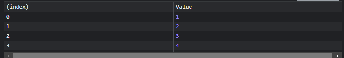
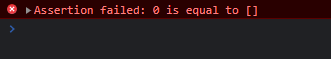

# CONSOLE LOG ALTERNATIVES

<br>

1. [destructuring](#1-destructuring)
2. [console.group](#2-consolegroup)
3. [console.table](#3-consoletable)
4. [console.time](#4-consoletime)
5. [console.assert](#5-consoleassert)
6. [console.count](#6-consolecount)
7. [console.trace](#7-consoletrace)
8. [debugger keyword](#8-debugger-keyword)
9. [resources](#resources)

<br><hr /><br>

## 1. DESTRUCTURING

<br>

By using the destruction power of javascript objects, you can do this:
<br>

```js
const { log } = console;

log("hi");
log("testing");
```

<br><br>

You can change the log function to any other name you want like this:
<br>

```js
const { log: myLog } = console;

myLog("hi");
myLog("testing");
```

<br><hr /><br>

## 2. console.group

<br>

Grouping logs:
<br>

```js
console.group("groupName");
console.log("hi");
console.log("testing");
console.groupEnd();

console.group("groupName2");
console.log("hi");
console.log("testing");
console.groupEnd();
```

<br><br>


<br><hr /><br>

## 3. console.table

<br>

Useful for printing an array.
<br>

```js
const arr = [1, 2, 3, 4, 5];
console.table(arr);
```

<br><br>



<br><hr /><br>

## 4. console.time

<br>

This method is used to measure time. For example, checking how many seconds it went to complete the x task?
<br>

```js
console.time("test");
setTimeout(() => {
  console.timeEnd("test");
}, 1000);

// test: 1.000s
```

<br><hr /><br>

## 5. console.assert

<br>

This method is used to check if a condition is true. If it's not, it will throw an error.
<br>

```js
console.assert(/** Condition **/, /** Error message **/);


console.assert(1 === 1, "1 is equal to 1"); // No error
console.assert(0 === [], "0 is equal to []"); // Error in the console
```

<br><br>



<br><hr /><br>

## 6. console.count

<br>

Count the number of times a certain thing happens.
<br>

```js
console.count("counter 1");

for (let i = 0; i < 10; i++) {
  i % 2 == 0 ? console.count("counter 1") : console.count("counter 2");
}
```

<br><br>


<br><hr /><br>

## 7. console.trace

<br>

This method traces where it was called. I have an HTML file like this:
<br>

    <!DOCTYPE html>
    <html lang="en">
        <head>
            <meta charset="UTF-8" />
            <meta http-equiv="X-UA-Compatible" content="IE=edge" />
            <meta name="viewport" content="width=device-width, initial-scale=1.0" />
            <title>Document</title>
        </head>

        <body>
            <script>
                "test";

                console.trace();

                i = 0;
            </script>
        </body>
    </html>

<br><br>

Now you can see where `console.trace` was called.
<br><br>


<br><hr /><br>

## 8. DEBUGGER keyword

<br>

Used to stop the execution of the code.
<br>

```js
const buggyCode = () => {
  debugger;
  console.log("hi");
};

// ...

buggyCode();

console.log("World");
```

<br><br>

This pauses the execution of the code and you can see something like this:

<br><br>


<br><br>

And it tells you where the debugger was called.

<br><br>


<br><br>

<br><hr /><br>

## Resources

<br>

- [Article](https://devdojo.com/posandu/consolelog-alternatives-you-didnt-know)

- [YT: console.log in 100 secs](https://www.youtube.com/watch?v=L8CDt1J3DAw&list=WL&index=13)
