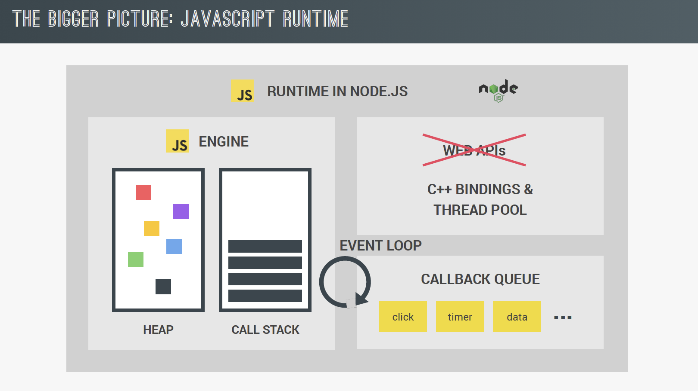

# How JavaScript Works Behind the Scenes

<p>&nbsp;</p>

_Personal notes from Udemy course [The Complete JavaScript Course 2022](https://www.udemy.com/course/the-complete-javascript-course/) by Jonas Schmedtmann. 
I do not own visual materials. Distribution is prohibited._

<p>&nbsp;</p>

* An High-Level Overview of JavaScript
* The JavaScript Engine and Runtime
* Execution Contexts and The Call Stack
* Scope and the Scope Chain
* Scoping in practice
* Variable Environment: Hoisting and The TDZ
* Hoisting and TDZ in practic
* The `this` keyword in practice
* Regular Functions vs. Arrow Functions
* Primitives vs. Objects (Primitive vs. Reference Types)
* Primitives vs. Objects in Practice

<p>&nbsp;</p>

## An High-Level Overview of JavaScript


### GARBAGE COLLECTION

- algorithm inside JS engine automatically removes old unused objects from computer memory
- powerful tools for memory management
<p>&nbsp;</p>

### HIGH LEVEL

- in low-level languages (C) you have to manage resources (ask the computer for memory to create a new variable)
- in high-level languages (JS, Python) have **abstractions** that handle the memory, everything happens automatically

- easier to learn
- program is never as optimised as program written in low-level language
<p>&nbsp;</p>

### INTERPRETED OR JUST-IN-TIME COMPILED LANGUAGE

- computer processor only understands 0 and 1 (machine code, not practical)
- no one writes it manually
- we write human-readable JS code

- it is abstraction over machine code
- it has to be **translated back to machine code: COMPILING or INTERPRETING**
- necessary step in every programming language
- happens inside JS engine
<p>&nbsp;</p>

### MULTI PARADIGM LANGUAGE

_PARADIGM_ = approach & mindset of structuring code, directs coding style & technique 
<p>&nbsp;</p>

**3 popular paradigms:**

  1. PROCEDURAL PROGRAMMING
      -- organising code in linear way
      -- having functions in between

  2. OBJECT-ORIENTED PROGRAMMING (OOP)
  3. FUNCTIONAL PROGRAMMING (FP)
<p>&nbsp;</p>

Paradigms can be:

 * **imperative**
 * **declarative**
<p>&nbsp;</p>

### PROTOTYPE-BASED OBJECT-ORIENTED 

Almost everything in JS is an object (except primitive values).
<p>&nbsp;</p>

**prototypal inheritance**

	- **we create from a blueprint, which is called PROTOTYPE**
	- prototype contains all the object methods
	- objects created from the prototype inherit all the methods from it
<p>&nbsp;</p>

Prototype examples:

	  `array.prototype.push()`
	  `array.prototype.indexOf()`

Array made from it:

	  `const arr = [1, 2, 3];`
	  `arr.push(4);`
	  `const hadZero = arr.indexOf(0) > -1;`
<p>&nbsp;</p>

### FIRST-CLASS FUNCTIONS

- those functions are treated as variables
- we can pass functions in & return functions from other functions
- extremely powerful
- allows functional programming
<p>&nbsp;</p>

example of passing the function into another function:

  `btnNew.addEventListener("click", init);`
<p>&nbsp;</p>

### DYNAMIC LANGUAGE

- meaning: **dynamically typed (type of variables can easily be changes as we reassign them)**
<p>&nbsp;</p>

- we don't assign data types to variables
- data types become known when JS engine executes code
- no data types --> data type become known at runtime

(Typescript - for JS written with types, _strongly typed_)

  _A strongly-typed programming language is one in which each type of data (such as integer, character, hexadecimal, packed decimal, and so forth) is predefined as part of the programming language and all constants or variables defined for a given program must be described with one of the data types._
<p>&nbsp;</p>

### SINGLE-THREADED, NON-BLOCKING EVENT LOOP concurrency model#


**Concurrency model:**

- how JS engine handles multiple tasks happening at the same time
- we need it because JS runs in one single thread = it can only do one thing at a time
- therefore we need a way of handling multiple things happening at the same time
<p>&nbsp;</p>

**Thread:**

- set of instructions executed in computers CPU (_central processing unit_, processor)
- **thread is where our code is executed in the machine's processor**
- long running tasks (i.e: fetching data from a remote server) don't block the single thread because of the **event loop**
<p>&nbsp;</p>

**Event loop:**

- takes long-running tasks
- executes them in the "background"
- puts them back in the main thread once they are finished
<p>&nbsp;</p>

(All of this is a huge over-simplification.)


## The JavaScript Engine and Runtime
<p>&nbsp;</p>

### JS ENGINE

- computer program that executes JS code
- every browser has its own JS engine
- most known is Google's V8 (written in C++) > it powers Chrome & Node.js (for building server side apps with JS outside of any browser)
<p>&nbsp;</p>

**JS engine COMPONENTS**

**CALL STACK:** where the code is executed using execution contexts
**HEAP (hrpa):** unstructured memory pool which stores all the objects the app needs
<p>&nbsp;</p>


<p>&nbsp;</p>


#### HOW JS engine WORKS
How is the code compiled to machine code so it can be executed?
<p>&nbsp;</p>


<p>&nbsp;</p>

 **Compilation**

 **Entire code is converted into machine code at once**, then written to a portable (binary) file that can be executed on any computer.

      _source code > **step 1: compilation > portable file** (machine code) > **step 2: execution** > program running  in the CPU_

  - execution can happen way after the compilation
  - any app on our computers have been compiled before
<p>&nbsp;</p>


 **Interpretation**

  **There is an interpreter that runs through the code and executes it line by line.**
  - the code is **read and executed at the same time**
  - source code is still converted to machine code, but right before it is executed, not ahead of time

      _source code > **step 1: execution line by line** > program running_

  **JS used to be only interpreted language.**
  Problem: it is slower than compiled languages.
<p>&nbsp;</p>


### HOW MODERN JS ENGINE WORKS

Modern JS engine uses mix between compilation & interpretation.
<p>&nbsp;</p>

**JIT compilation (just-in-time compilation)**
Entire code is compiled into machine code at once and executed right away.

      _source code > step 1: compilation > machine code (without portable file) > step 2: execution > Program running_


<p>&nbsp;</p>


<p>&nbsp;</p>

As the JS code enters the JS engine...

### 1. Parsing = reading the code

  - code is parsed into **AST** (abstract syntax tree, data structure; **has nothing to do with DOM tree**)
  - splits each line of code into pieces meaningful to the language (const, function ... )
  - saves those pieces into the tree in a structured way
  - checks for syntax errors
  - resulting AST is later used to generate machine code
<p>&nbsp;</p>

### 2. Compilation

  -- takes generated AST and compiles it into machine code
<p>&nbsp;</p>

### 3. Execution

  -- machine code gets executed right away
  -- it happens in JS engine Call Stack

<p>&nbsp;</p>
**Parsing, compilation and optimisation happen in special threads in CPU that are not accessible from the code.**
They are separated from the main thread that is executing the code.
<p>&nbsp;</p>

**JS engines have optimisation strategies**

- at the beginning, they create unoptimised machine code
- it starts as fast as possible

- in the background, the code is being optimised and re-compiled during the already running program execution
- can be done multiple times
- old code is swapped with the new optimised code without stopping executions

**This process makes modern JS engines fast.**
<p>&nbsp;</p>


## JS RUNTIME

****RUNTIME IN THE BROWSER (mostly used)****
<p>&nbsp;</p>


<p>&nbsp;</p>

**Runtime is a container including all the things we need to use JS** 
(1, 2, 3, 4)

- Heart of every JS Runtime is **JS engine (1)**.

- In order for it to work properly, we need access to **Web APIs (2)** (_DOM, console.log(), timers, fetch API..._).

  Those are functionalities provided to the browser, but are not part of JS language.
  They are accessible in the global `window` object, through JS gets access to them.

- **Callback queue (3)** is data structure containing all callback functions ready to be executed.
<p>&nbsp;</p>

* **callback function** = _function passed into another function as an argument, which is then invoked inside the outer function to complete some kind of routine or action (example: event handler functions)_

Example of CALLBACK QUEUE: callback function from DOM event listener

- **EVENT LOOP (4)**

  1. event happens
  2. callback function is put onto the callback queue by the event loop
  3. when the call stack is empty, the callback function is passed to the stack by the event loop
  4. execution of the callback function

-- essential for JS non-blocking concurrency model


**JS RUNTIME IN Node.js**

  - JS ENGINE
  - C++ & THREAD POOL
  - CALLBACK QUEUE
  - EVENT LOOP


 
 
 ___

## Execution Contexts and The Call Stack

[262.ECMA - 10.4. Establishing an Execution context](https://262.ecma-international.org/5.1/#sec-10.4)

How i JS code executed?
Where? 

**In the call stack, in the JS Engine.**

compilation > creation of GLOBAL EXECUTION CONTEXT for top-level code


1. step: **Creation of global execution context (EC)**

  = environment in which piece of JS is executed
  = like a box that stores all necessary info for code to be executed (local variables, arguments passed into a function... )

  - JS code always runs inside execution context
  - for every JS project there is only one EC (default), where top level code will execute


2. step: **Execution of top-level code**

  = only the code outside functions (because functions should only be executed when called)

  -computer CPU processes received machine code


3. step: **Execution of functions, waiting for callbacks**

  One execution context per function call/method (they're functions attached to objects).

      GLOBAL EXECUTION CONTEXT + EXECUTION CONTEXT PER FUNCTION/method = **JS engine's CALL STACK**


When all functions are executed, JS Engine waits for callback functions to arrive.
Callback loop provides them.


### WHAT IS EXECUTION CONTEXT MADE OF?


**1. variable environment**

  - let, const, var declarations
  - functions
  - `arguments` object - all the arguments passed into the function that the current execution context belongs to
  
     _`arguments` is an Array-like object accessible inside functions that contains the values of the arguments passed to that function_


**2. scope chain**

  - consists of references to variables located outside of the current function


**3. `this` keyword**

  Content is generated during creation phase, right before the execution.


__Exception: arrow functions () => {}__

    - no `argument` object
    - no `this` keyword
    - can use them from their closest regular function parent.


**Technically, values only become known during execution phase.**


### When there are a lot of function execution contexts:

  How does the engine keep track of the order in which the functions are called?
  How will it know where it currently is in the execution?


  **CALL STACK**
  = "place" where execution contexts get stacked on top of each other, to keep track of where we are in the execution


  - execution context on the top is the on that is running
  - after it finishes, it is removed
  - the one "underneath" starts running

  **Call stack is like a "map" for the order of the execution of the code.**


Program stays in the state with the global execution context forever, until it is actually finished.
= closing of the browser tab/window

Only then is the global execution context popped off the JS engine call stack.


___ 

## Scope and the Scope Chain


**VARIABLE ENVIRONMENT**
How the variables are created

**EXECUTION CONTEXT is made of:**

  - variable environment
  - scope chain
  - `this` keyword


WHAT IS SCOPE CHAIN?
WHY IS IT SO IMPORTANT?
HOW DOES IT WORK?


### SCOPING


  Where do variables live?
  Where can we access a certain variable and where not?
  Answers the question how our program's variables are organised and accessed.

**Lexical scoping**

Scoping is controlled/ way variables are organised and accessed is entirely controlled by the placement of functions and blocks in the code.

  example: _Function written inside another function has access to the variables of the parent function._


**Scope**

= space/environment in which a variable is **declared**

- in case of functions, the function itself is a variable environment, stored in the function execution context


**Scope of a variable**

= entire region of the code where a certain variable can be accessed

	

**Difference between scope and variable environment**

In case of functions, it is the same because functions are just values stored in variables.


* GLOBAL SCOPE
* FUNCTION SCOPE
* BLOCK SCOPE (ES6)

    #### Global scope

    - for top level code
    - outside of any function or block
    - variables declared in GS are accessible everywhere in the program (in all functions or blocks)

    ```js
    const me = "Mari";
    const job = "programmer";
    const year = "2021";
    ```


    #### Functions scope

    - each function creates a local scope
    - variables are accessible only inside function, not outside

    ```js
    function calcAge(birthYear) {
      const now = 2037;
      const age = now - birthYear;
      return age;
    }
    
    console.log(now); // Reference error - variable is inside of local scope, can't be reached
    console.log(calcAge);
    ```


    #### Block scope (ES6)

    - variables are accessible only inside block
    - only applies to let, const variables
    - LET, CONST are BLOCK SCOPED

    - **var is FUNCTION SCOPED**

        - they only care about functions
        - they ignore blocks

    - in _strict mode_, functions are block scoped (from ES6)
    - functions declared inside a block are only accessible inside of this block

    ```js
    if(year >= 1981 && year <= 1996) {
      const millenial = true;
      const food = "Avocado toast";
    }
    
    console.log(millenial); // Reference error
    ```


  ### SCOPE CHAIN 

  

  **Every scope has access to the variables from all the outer scopes.**

  **Variable look-up**

  If one scope can't find the variable in its parent scope, it will look up the scope chain to see if it can find it in other parent scopes.

  In this process, variables are **not copied from one scope to another**, only used.

  **It doesn't work the other way around:**

      child scope can use parent scope,
      parent scope can't use child scope.

  **Sibling scopes** don't have access to one another.
  Scope chain does not work SIDEWAYS nor DOWN, only UP.

  *Works the same for function arguments.

**global variables** = variables in the global scope


**Scope chain vs call stack**

  Scope chain is the order in which functions are written in the code.
  It has nothing to do with order in which functions are called and executed in the call stack.


[Execution vs Lexical vs Variable environment](https://medium.com/@bdov_/javascript-typescript-execution-vs-lexical-vs-variable-environment-37ff3f264831)
___

## Scoping in practice


Function `calcAge()` is defined in a global scope.

- it is in a top level code
- it defines its own scope = variable environment of its execution context

  ```js
  function calcAge(birthYear) {
    const age = 2021 - birthYear;
    console.log(firstName);
  
    return age;
  }
  
  const firstName = "Mari";
  calcAge(1985);
  ```
 
  ### Nested functions

  - engine tries to access age variable in the current scope (_printAge()_ scope) > doesn't find it > goes UP to the parent scope > finds it there (_calcAge()_ scope)
  - **scoping is the same for parameters of a function as it is for variables**
  - scope of a variable is the entire region in which the variable is accessible
  ( `age` is accessible inside `calcAge` function and all the child scopes (inner scopes))

    ```js
    function calcAge(birthYear) {
      const age = 2021 - birthYear;
    
      function printAge() {
        const output = `You are ${age}, born in ${birthYear}.`
        console.log(output)
      }
      printAge();
      return age;
    }
    
    const firstName = "Mari";
    calcAge(1985);
    
    // reference error - cannot access scope
    console.log(age);
    printAge();
    ```

  ### Block scope

  `console.log(str);` isn't accessible

  `console.log(millennial)` is accessible =  **VAR is pre-ES6, function-scoped variable**, it ignores blocks

  - don't use VAR if you don't have to

  ```js
  function calcAge(birthYear) {
  const age = 2021 - birthYear;
  //console.log(firstName);
 
  function printAge() {
    const output = `${firstName}, you are ${age}, born in ${birthYear}.`
    console.log(output)
 
    //BLOCK SCOPE
    if(birthYear >=1981 && birthYear <= 1991) {
      var millennial = true;
      const str = `Oh, and you are a millennial, ${firstName}.`
      console.log(str);
    }
    console.log(str);  // reference error
    console.log(millennial); // accessible, VAR is pre-ES6 variable 

    }
    printAge();
    return age;
  }
  
  const firstName = "Mari";
  calcAge(1985);
  ```


**From ES6, functions are block-scoped**
 **when in strict mode**


```js
    //block scope
    if(birthYear >=1981 && birthYear <= 1991) {
      var millennial = true;
      const str = `Oh, and you are a millennial, ${firstName}.`
      console.log(str);
 
      // functions are block-scoped (>= ES6)
      function add(a, b) {
        return a+b;
      }
    }
 
    console.log(str);  // reference error
    console.log(millennial); // accessible, VAR is pre-ES6 variable
 
    add(2, 3); // reference error, not accessible outside of the "if" block
```


**Declaring a variable inside of a scope that already exists in a parent scope**

JS will look for the variable inside of the scope because it reads what is in the block scope first.

JS won't perform any variable look-up in the scope chain because it found the variable inside of the block that it will use.

```js
function calcAge() {
  (...)
 
  function printAge() {
    (...)
 
    if(birthYear >=1981 && birthYear <= 1991) {
      var millennial = true;
      firstName = "Jonas";
 
      const str = `Oh, and you are a millennial, ${firstName}.`
      console.log(str)
     }
    }
  } 
  (...)
}
 
const firstName = "Steven";
console.log(str); // "Oh, and you are a millennial, Jonas."
```

You can have variables with same names, if they are in different scopes.
You can have functions with same parameter names because each parameter is defined in the scope of that function.


**Redefining a variable from a parent scope inside of the variable scope**

It will print reassigned value because we redefined a variable inside of "if" block from the parent scope (printAge()), we didn't create a new one.
If we created a new one, it wouldn't be accessible.

```js
function printAge() {
   let output = `${firstName}, you are ${age}, born in ${birthYear}.`
 
   //block scope
   if(birthYear >=1981 && birthYear <= 1991) {
      var millennial = true;
 
      // Creating a new variable with the same name as outer scope's variable
      const firstName = 'Jonas';
 
      // Reassigning value to outer scope's variable
      output = "New output!";
 
      const str = `Oh, and you are a millennial, ${firstName}.`
      console.log(str);
 
      // functions are block-scoped (>= ES6)
      function add(a, b) {
        return a+b;
      }
   }
   console.log(output);  // Prints reassigned value!
}
```

___

## Variable Environment: Hoisting and The TDZ

[262.ECMA - 10.3. Variable environment](https://262.ecma-international.org/5.1/#sec-10.3)

**HOISTING**

  Makes some types of variables accessible/usable in the code before they are declared.

  "Variables lifted to the top of their scope."

  **How are variables created in JS?**

  **Hoisting behind the scenes:** the code is scanned for declarations before it is executed during the creation phase of the execution context.
  For each variable, a new property is created in the variable environment object.

  **Execution context always contains 3 parts:**

      - variable environment
      - scope chain
      - `this` keyword


  **Why hoisting?**

  - using functions before declaration (essential for some techniques)
  - code is more readable


  **Hoisting doesn't work the same for all variable types**

  * **FUNCTION DECLARATION**

    ```js
    function calcRectArea(width, height) {
      return width * height;
    }
    
    console.log(calcRectArea(5, 6));
    // expected output: 30
    ```

  * **FUNCTION EXPRESSION (with variable)**

    ```js
    const getRectArea = function(width, height) {
      return width * height;
    };
    
    console.log(getRectArea(3, 4));
    // expected output: 12
    ```

  * **ANONYMOUS FUNCTION**

    ```js
    function (a){
      return a + 100;
    }
    ```

  * **ARROW FUNCTION EXPRESSION  =>**

    ```js
    // 1. Remove the word "function" and place arrow between the argument and opening body bracket
    (a) => {
      return a + 100;
    }
    
    // 2. Remove the body braces and word "return" -- the return is implied.
    (a) => a + 100;
    
    // 3. Remove the argument parentheses
    a => a + 100;
    (a, b) => a + b + 100;
    ```

**Function declarations:**

- hoisted
- initial value: variable environment is set to actual function
- scope: block (in strict mode)

We can use function declarations before they are declared in the code because they are stored in variable environment object even before the code starts executing.


**`var` variables:**

- hoisted
- initial value: undefined
- scope: function

If we try to access a var variable before it is declared in the code, we don't get the declared value, but undefined.
This behaviour is one of the common sources of bugs in JS.
And why in modern JS we almost never use `var`.


**`let` and `const` variables:**

- not hoisted
- initial value: <uninitialized>, TDZ
- scope: block

They are technically hoisted, but there is no value to work with.
They are placed in temporal dead zone (TDZ), we can't access the variables in the place between the beginning of the scope and the place where the variables are declared.
If we try to use them before they are declared, we get error.


**Function expressions & arrow function expressions:**

- depends if they were created with var or `const`/`let`
**These functions are variables** and behave like ones in regard to hoisting.


  ### TDZ

  `let`, `const`

  Variable can be declared (without value) in the TDZ, but it won't be accessible before the line where it is initialised (added value).


  **Why TDZ?**

  1. Makes it easier to avoid and catch errors.
     Accessing variables before declaration is bad practice and should be avoided.

  ```js
  const myName = "Jonas";
  
  if(myName === "Jonas") {
      console.log(`Jonas is a ${job}.`); // Ref. error: cannot access "job" before initialisation"
      const age = 2021 - 1991;
      console.log(age);
  
      const job = "teacher"; // everything before is TDZ, here "job" is defined and can be accessed
      console.log(x);  // Ref.error: x is not defined
  }
  ````


2. Makes const variables work the way they are supposed to.

  It is not possible to declare a const variable first, and later assign the value.
  `const` should never be reassigned.
  It is assigned only once, when the execution reaches the declaration.


___

## Hoisting and TDZ in practice

### Variables

  ```js
  console.log(me);
  console.log(job);
  console.log(birthYear);
  
  var me = " Mari";
  let job = "programmer";
  const birthYear = 1987;
  
  // undefined (for var)
  // ReferenceError: Cannot access 'job' before initialization
  ```


### Functions

- only function declaration is accessible before initialization
- functions defined with const are not accessible because they are in a temporary dead zone

_ReferenceError: Cannot access before initialization_
- funcions defined with `var` are not accessible, you get another error: 

_TypeError: is not a function_

Those variables are hoisted and added a value of undefined.
They are basically being called with undefined: `undefined(2, 3);`

  ```js
  console.log(addDeclaration(2, 3));  // 5
  
  console.log(addExpression(1, 2));
  // ReferenceError: Cannot access 'addExpression' before initialization
  
  console.log(addArrow(3, 4));
  // ReferenceError: Cannot access 'addArrow' before initialization
  
  
  function addDeclaration(a, b) {
    return a + b;
  }
  
  const addExpression = function (a, b) {
    return a + b;
  }
  
  var addArrow =  (a, b) => {
    return a + b;
  }
  ```


**Example of hoisting mistake**

- why we should not use `var`

  ```js
  console.log(numProducts); // returns "undefined"
  
  // deletes the shopping cart whenever the number of products is 0
  // zero is falsy value
  if(!numProducts) {
    deleteShoppingCart();
  }
  
  var numProducts = 10;
  
  function deleteShoppingCart() {
    console.log("All products deleted!");
  }
  ```

--> all products get deleted because of hoisting

`var` was called before declared --> it has value of _undefined_, not 10, which is assigned later > it triggers the execution of if-block and deletes all items because they are not 10, but undefined


### HOISTING - BEST PRACTICES


1. **don't use `var` to declare variables**

- use `const` most of the time
- use `let` if you need to change variable later

2. **declare variables at the top of each scope**

3. **always first declare functions, use them after declaration**


### Difference between var and const/let


  ```js
  var x = 1;
  let y = 2;
  const z = 3;
  ```
In the `Window` object (global object of JS in the browser) in the Console, we can find x.
The is no y nor z.

Variables declared with `var `create properties on the `Window` object.
Variables declared with `const`/`let`, do not.

```js
// testing if x, y and z are properties of Window object
console.log(x === window.x); // true
console.log(y === window.y); // false
console.log(z === window.z); // false
```

___

## The _this_ keyword


EXECUTION CONTEXT: 

1. variable environment
2. scope chain

3. `this` **keyword**

  - a special keyword/variable
  - created for every execution context (every function)


**VALUE of** `this`

- it **takes the value of the owner of the function** in which `this` was used (it points to the owner of that function)
- value of `this` is not static = it is not always the same
- its value is assigned only when the function is called
- it depends on how the function is called


**4 ways to call a function:**

  1. AS A METHOD

  2. AS A NORMAL FUNCTION

  3. arrow functions => (not exactly a way to call a function)

  4. AS AN EVENT LISTENER


  5. `new`, `call`, `apply`, `bind` (covered later)


  ### 1 - Call a function as a method
    (a function attached to an object)

    When we call a method, `this` will point to the object on which the method is called.

      ```js
      const mari = {
        name: "Mari",
        year: 1987,
        calcAge: function() {
          return 2021. - this.year;
        }
      };
      console.log(mari.calcAge()); // 34
      ```

    `this.year` = `mari.year`


      
    ### Call function as a normal function
      (not attached to any object)

      In strict mode:

      `this` will be _undefined_

     **Recommended.**


      In sloppy mode:

      `this` points to the `Window` object (global JS object in browser)

      This can be very problematic.


    ### ARROW FUNCTIONS =>

      **! They do not get their own .this keyword!**

      It will belong to the surrounding/parent function = lexical `this` keyword
      It gets picket up from the outer lexical scope of the arrow function.


    ### Call function as an event listener

      `this` will point to the DOM element the handler is attached to.


  
**WHAT `this` IS NOT:**

- never points to the function in which we are using it
- never points to the variable environment of the function


___

## The `this` keyword in practice

**RULES HOW `this` IS DEFINED**


`this` **outside any function** (in the global scope)

    `console.log(this);  // points to Window object`


`this` **inside regular function call**
  - function that is not attached to any object (has no "owner")

      ```js
      "use strict";
      
      const calcAge = function(birthYear) {
        console.log(2021 - birthYear);
        console.log(this);
      }
      
      calcAge(1987);
      // 34
      // undefined
      ```

**with arrow function =>**
  - uses the lexical .this keyword of its parent scope (here: Window)

      ```js
      const calcAgeArrow = birthYear => {
        console.log(2021 - birthYear);
        console.log(this);
      }
      
      calcAgeArrow(1987); // points to Window object
      ```
      

`this` **inside of a method**
  - points to the object it belongs to ("jonas" object is the owner of .this)

      ```js
      const jonas = {
        year: 1987,
        calcAge: function() {
          console.log(this);
          console.log(2021 - this.year);
        }
      }
      
      jonas.calcAge();
      // points to "jonas" object
      // 34
      ```

`this` will not point to the object in which we wrote the method.
It will point to the object that is calling the method.
It is because of this: `jonas.calcAge();`


  ### METHOD BORROWING

  **Functions are values.**
  We can copy them from one object to another

      ```js
      matilda.calcAge = jonas.calcAge;
      
      < matilda
      > {year: 2017, calcAge: ƒ}
      // calcAge shows in the matilda object in the console 
      
      < jonas
      > {year: 1987, calcAge: ƒ}

      matilda.calcAge();  // 4
      ```

  Here, `this` points to object matilda which called the method.
  This proves that `this` is not static - it depends on how the function is called.


**Taking the function out of the object**

We want to copy the function into a new variable (we can because function = value).
Don't call it!

  ```js
  const jonas = {
    year: 1987,
    calcAge: function() {
      console.log(this);
      console.log(2021 - this.year);
    },
  };
  
  const f = jonas.calcAge; 
  
  // shown in the f object
  < f
  > ƒ () {
      console.log(2021 - this.year);
    }
  ```

**What implication does it have for `this` keyword?**

```js
f();
 
> undefined
> Uncaught TypeError: Cannot read properties of undefined (reading 'year'
```

`console.log(2021 - this.year);`

this = _undefined_
year cannot be read

`this` is now _undefined_ because `f();` is now just a regular function call, without no "owner", it isn't attached to any object.

___

## Regular Functions vs. Arrow Functions

`this`

**REGULAR vs ARROW FUNCTIONS**

Starting point: OBJECT LITERAL
(the way we literally define objects; doesn't create its own scope, is not code block)

  ```js
  const jonas = {
    firstName: "Jonas",
    year: 1987,
    calcAge: function() {
      console.log(this);
      console.log(2021 - this.year);
    },
  
    greet: () => {
      console.log(`Hey, ${this.firstName}.`);
    }
  };
  
  jonas.greet();  // Hey, undefined.
  ```

We get _undefined_ because arrow function doesn't have its own `this`, it uses the one from its own surroundings.

**And the parent scope of `greet()` method is the global scope.**

`this` points to the Window object.
On the Window object, there is no firstName, so we get _undefined_.


Using `this` with arrow functions can be dangerous if we declare variables with `var`.
`Var` creates properties on a global object (`window`).

  ```js
  var firstName = "Matilda";
  
  const jonas = {
    firstName: "Jonas",
    year: 1987,
    calcAge: function() {
      console.log(this);
      console.log(2021 - this.year);
    },
  
    greet: () => {
      console.log(this);
      console.log(`Hey, ${this.firstName}.`);
    }
  };
  
  jonas.greet(); // Hi, Matilda
  ```

Inside `greet()` function, `window` is pointed by `this` keyword, although the function was called by the `jonas` object.

`Window` contains `firstName` property with value Matilda and it will be printed.

**Takeaway: never use arrow function as a method (as a function inside of an object).**


  ### Having a function inside of a method

  `isMillenial()` will be called when `calcAge()` is called

  ```js
  const jonas = {
    firstName: "Jonas",
    year: 1987,
    calcAge: function() {
      console.log(this);
      console.log(2021 - this.year);
  
      const isMillenial = function() {
        console.log(this.year <= 1996 && this.year >= 1981);
      }
      isMillenial();
    },
  
    greet: function() {
      console.log(this);
      console.log(`Hey, ${this.firstName}!`);
    }
  };
  
  jonas.calcAge();
  // TypeError: Cannot read properties of undefined (reading 'year')
  ```

Inside of the `isMillenial()` function, `this` is undefined.

`isMillenial()` is a **regular function call**, even though it happens inside of a method (`calcAge()`). Inside of a regular function call, `this` is undefined, that is why we get the error.

**The behaviour is as if the functin `isMillenial()` was outside of the object.**


 ### 2 solutions to the problem of .this  used in function inside of a method:

    1. pre-ES6: **use extra variable, self / that outside of the function**

      There you still have access to .this set to jonas object because of the scope chain.
      Then use it in the function.

      ```js
      calcAge: function() {
          console.log(this);
          console.log(2021 - this.year);
      
          // Solution 1
          const self = this;
          const isMillenial = function() {
            console.log(self.year <= 1996 && self.year >= 1981);
          }
          isMillenial();
        },
      (...)
      }
      
      jonas.calcAge(); 
      // 34
      // true
      ```

    
    2. ES6 solution: **use an arrow function**

      It is going to work because arrow function does not have its own `this` keyword.
      It will use `this` of its parent scope > `calcAge()` method, where `this` points to jonas object

      ```js
      // Solution 2
      const isMillenial = () => {
        console.log(this.year <= 1996 && this.year >= 1981);
      }
      isMillenial();
      
      jonas.calcAge();
      // 34
      // true
      ```


  ### `arguments` keyword

  Functions also get access to arguments keyword (function declarations and expressions).
  `arguments` is only available in regular functions.


  ```js
  const addExpression = function (a, b) {
    console.log(arguments);
    return a + b;
  }
  
  addExpression(2, 5);
  addExpression(2, 6, 8, 9);
  
  // > Arguments(2) [2, 5, 8, 9 callee: (...), Symbol(Symbol.iterator): ƒ]
  ```

  We get an array with parameters that we passed in.
  Useful when we need more parameters than specified.
  We could loop over arguments array and loop all numbers together.

  ***

  **Arrow function doesn't get `arguments` keyword.**

  ```js
  var addArrow =  (a, b) => {
    console.log(arguments);
    return a + b;
  }
  
  addArrow(2, 6);
  // ReferenceError: arguments is not defined at addArrow
  ```


This keyword is not so important in > ES6, there is better way of dealing with arguments.

___

## Primitives vs. Objects (Primitive vs. Reference Types)

**PRIMITIVES vs OBJECTS (Primitive vs Reference type)**
Difference in how primitive types and objects are stored in memory


**PRIMITIVES:**

number
string
boolean
udefined
null
symbol
BigInt

**OBJECTS:** everything else


example with primitives:

  ```js
  let age = 30;
  let oldAge = age;
  age = 31;
  
  console.log(age);       // 31 
  console.log(oldAge);    // 30
  ```

example with object:

  ```js
  const me = {
    name: "Mari",
    age: 30, 
  }
  
  const friend = me;
  friend.age = 27; 
  
  console.log("Friend:", friend);  // Friend: {name: 'Mari', age: 27}
  console.log("Me:", me);          // Me: {name: 'Mari', age: 27}
  ```


**In context of memory:**

  primitives = **primitive types**
  objects = **reference types**

They are stored differently.


**JS engine:**

  **call stack** (where the code is executed)
  **heap** (where objects are stored in memory)

**Primitive types** are stored in the **call stack**, in the **execution contexts** in which they are declared.
**Objects** are stored in JS Engine's **heap**.


  ### Storing primitive types 

  When we declare a variable const age = 30;, here is what happens inside JS Engine and computer's memory.


  **IN CALL STACK:**

  1. JS creates unique identifier with variable name (age).
  2. A piece of memory gets allocated, with a certain address (000 1).
  3. Value gets stored in memory at the specified address (30).


  ***Identifier points to the ADDRESS, not to the value.**

  no: Age is equal to 30.
  yes: Age is equal to the address 0001, which holds the value of 30.

  When we reassign the value to the variable, we reassign it a different address that holds that new value.
  We don't reassign a new value to the existing address.

  **Value at a certain address is immutable.**

  
  
  ### Storing reference types

  **in the CALL STACK:**

  1. created unique identifier
  2. points to new memory address
  3. memory address references to the **memory address of the object in the heap** (used as its value)


  **in the HEAP:**

  1. assigned a memory address
  2. address has an assigned

  The identifier doesn't point directly to the new created address in the heap.
  That is why we call objects - reference types, in this context.

  Objects might be too large to be stored in the stack.
  Instead, the are stored in the stack (unlimited), and only reference is stored in the call stack.


  
  ### Changing a property in the object
  (as seen from the memory perspective)

    `friend.age = 27;`

  1. object is found in the heap
  2. age is changed to 27

  Now we have 2 different identifiers (me, friend) pointing to the same value in the call stack, that is referencing the same object address in the heap, and they will have the same value.

  **Only primitive values defined with const are immutable.
  Reference values defined with const are mutable.**

    ```js
    const friend = me;
    friend.age = 27; 
    ```

  Although the object is defined with `const`, you can still change its value because you're not changing the value at the address in the call stack (which is reference to the object).

  **When you are copying an object, you are creating a new variable that is pointing to the exact same object.**


___

## Primitives vs. Objects in Practice

**Mutating a primitive**

Each primitive value will be saved into its own piece of memory in the stack.

  ```js
  // initial value
  let lastName = "Williams";
 
  // person is getting married so we save the old last name
  let oldLastName = lastName;
 
  // at this point in the code, the person is married and has new last name
  lastName = "Davis";
 
  console.log(lastName, oldLastName); // Davis, Williams
  ```

### Mutating objects (reference values)

  ```js
  const jessica = {
    firstName: "Jessica",
    lastName: "Williams",
    age: 32,
  };
  
  // Jessica is getting married and will change her last name
  const marriedJessica = jessica;
  marriedJessica.lastName = "Davis";
  
  console.log("Before marriage:", jessica);         // "Davis"
  console.log("After marriage:", marriedJessica);   // "Davis"
  ```

It looks like we are copying the whole object. Behind the scenes, we are copying the reference that points to the same  object. Those are two names for the same object.

`marriedJessica` **is not a new object in the heap.**
**It is just a new variable in the stack, which holds the reference to the original object,** `jessica`,
So we change the property in the original object from "Williams" to "Davis".

`const` is about the **value in the stack**, which is not changing and it is the reference to the object. The object in the heap is changing and it has nothing to do with `const`.


**Assigning a new object is completely different than changing a property.**

We can't assign a new object to the already existing variable marriedJessica , that has a reference to the object jessica in the heap.

This new object will be stored at a different position in memory and therefore the reference to that position in memory would have to change in this variable, which is declared in the call stack with const, and that doesn't work because we can't change that value in the stack.

If it was declared with let, this would work.

  ```js
  const marriedJessica = jessica;
  
  marriedJessica = {}; // this won't work
  // TypeError: Assignment to constant variable
  ```


**Copying an object so that we can change the copy without changing the original**

  `object.assign()`

**It merges 2 objects and returns new object with all properties copied.**

New object is created in the heap (empty one + copy of jessica2) and `jessicaCopy` is pointing to that new object.

  ```js
  const jessica2 = {
    firstName: 'Jessica',
    lastName: 'Williams',
    age: 32,
  };
  
  // merging new empty object with object jessica2
  const jessicaCopy = object.assign({}, jessica2);
  jessicaCopy.lastName = "Davis";
  
  console.log("Before marriage:", jessica2);
  console.log("After marriage", jessicaCopy);
  
  // Before marriage: {firstName: 'Jessica', lastName: 'Williams', age: 32}
  // After marriage {firstName: 'Jessica', lastName: 'Davis', age: 32}
  ```

This only works on the first level, **it creates a shallow copy**.

The object inside of an object would still be the same if this method is used > it would still point to the same place in the heap.

We would like to have a **deep clone**.

**Shallow copy** copies properties on the first level.
**Deep clone** copies everything.


If you add an array in ``jessica2``, it will be in both objects after you use ``Object.copy()``.

* array is just an object behind the scenes, so this works

  ```
  // Before marriage: {firstName: 'Jessica', lastName: 'Williams', age: 32, family: Array(2)}
  // After marriage {firstName: 'Jessica', lastName: 'Davis', age: 32, family: Array(2)}
  ```

Changing the existing array in a new/copied object

  ```
  // manipulating object within an object
  jessicaCopy.family.push("Bey");
  jessicaCopy.family.push("How");
  ```

**It changes the property `family` in both objects.**

They point to the same (nested) object `family` in the heap, so if you change it in one, you change it also in another one.

We would need to create here a **deep clone** (won't learn it).
